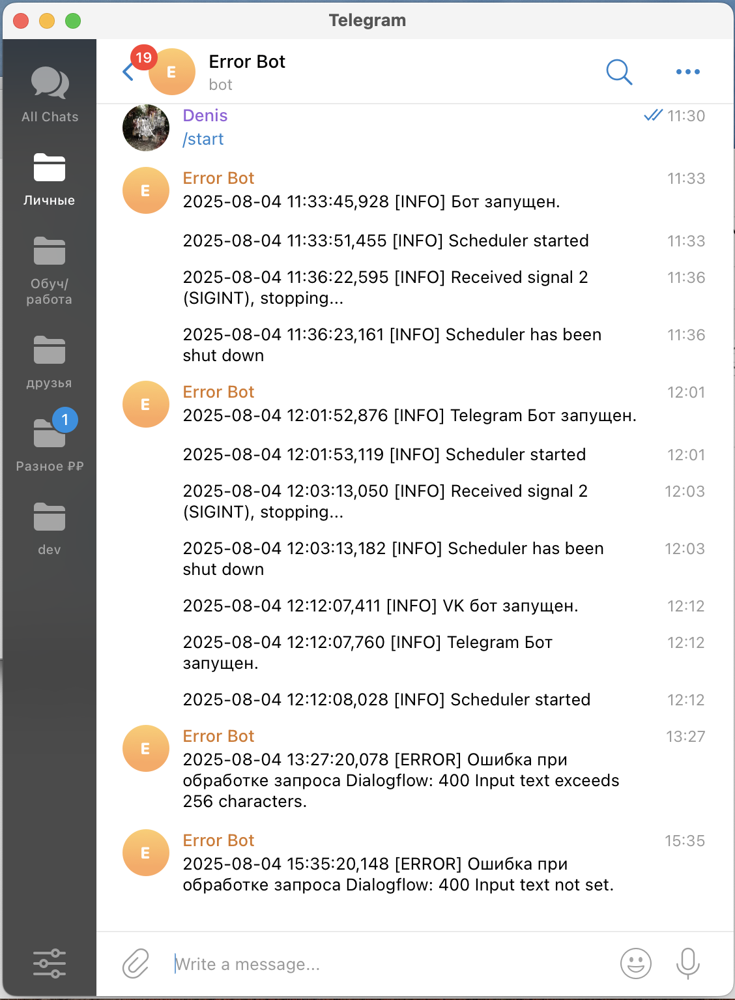

# Answer Assistant Bot

Проект включает двух ботов: для **Telegram** и **ВКонтакте**, которые интегрированы с **DialogFlow** для обработки сообщений пользователей.  
Боты распознают текстовые сообщения, определяют их смысл и отвечают заранее подготовленными фразами или сценариями.

## Возможности
- Поддержка двух платформ: **Telegram** и **ВКонтакте**.
- Интеграция с **DialogFlow**.
- Обработка пользовательских сообщений и ответы согласно заданным интентам.
- Логирование ошибок и ключевых событий с отправкой отчётов в Telegram-бота.
- Возможность лёгкого расширения ботов новыми интентами через API.

## Используемые технологии
- **Python 3.10**
- **python-telegram-bot** — для работы с Telegram API
- **vk_api** — для работы с VK API
- **google-cloud-dialogflow** — интеграция с DialogFlow
- **environs** — управление конфигурацией через `.env`

## Запуск
### 1. Клонируйте репозиторий
```bash
git clone https://github.com/username/Answer-Assistant-Telegram-Bot.git
cd Answer-Assistant-Telegram-Bot
```
### 2. Установите зависимости
Создайте виртуальное окружение и установите зависимости:
```bash
python3.10 -m venv venv
source venv/bin/activate
pip install -r requirements.txt
```

### 3. Настройте виртуальное окружение
Создайте файл `.env` в корне проекта и добавьте туда переменные:

```env
TELEGRAM_BOT_TOKEN=токен_вашего_бота
VK_GROUP_TOKEN=токен_группы_ВКонтакте
PROJECT_ID=id_вашего_проекта_DialogFlow
GOOGLE_APPLICATION_CREDENTIALS=/путь/к/файлу/ключа.json
ERROR_BOT_TOKEN=токен_бота_для_логов
ERROR_CHAT_ID=id_чата_для_логов
```

### 4. Запуск

**Telegram-бот:**
```bash
python bot/telegram_bot.py
```

**VK-бот:**
```bash
python bot/vk_bot.py
```

## Обучение бота
Для добавления новых интентов в **DialogFlow** используется скрипт `create_intent.py`.  
Это позволяет автоматически загружать тренировочные фразы и ответы в агента **DialogFlow**.

1. Подготовьте JSON-файл с фразами и ответами. Пример:
```json
[
  {
    "questions": [
      "Как устроиться к вам на работу?",
      "Как попасть к вам в команду?",
      "Можно ли у вас работать?"
    ],
    "answer": "Заполните анкету на нашем сайте и мы с вами свяжемся!"
  }
]
```

2. Запустите скрипт:
```bash
python create_intent.py questions.json
```

После выполнения скрипта в **DialogFlow** появится новый интент с фразами и ответами из файла.
Бот начнёт отвечать на эти запросы автоматически.

## Мониторинг
Боты отправляют ошибки и важные события в Telegram через специального лог-бота.

1. Создайте нового бота в Telegram через [@BotFather](https://t.me/botfather) и получите токен.

2. Добавьте его токен и ID чата в `.env`:

```env
ERROR_BOT_TOKEN=токен_бота_для_логов
ERROR_CHAT_ID=id_чата_для_логов
```
Узнать свой ID чата можно в [@getmyid_bot](https://t.me/getmyid_bot)

3. Все ошибки и ключевые события будут автоматически приходить в Telegram.

<p align="center">
  
</p>

## Пример диалога c ботом
### Telegram

<p align="center">
  
</p>

### VK

<p align="center">
  
</p>

### Ссылки на ботов
> Протестировать работу ботов вы можете по следующим ссылкам:
> - [Telegram Bot](https://t.me/answer_asssistant_bot)  
> - [VK Bot](https://vk.com/club231945578)

## Цель проекта
Код написан в образовательных целях на онлайн-курсе для веб-разработчиков [dvmn.org](dvmn.org)